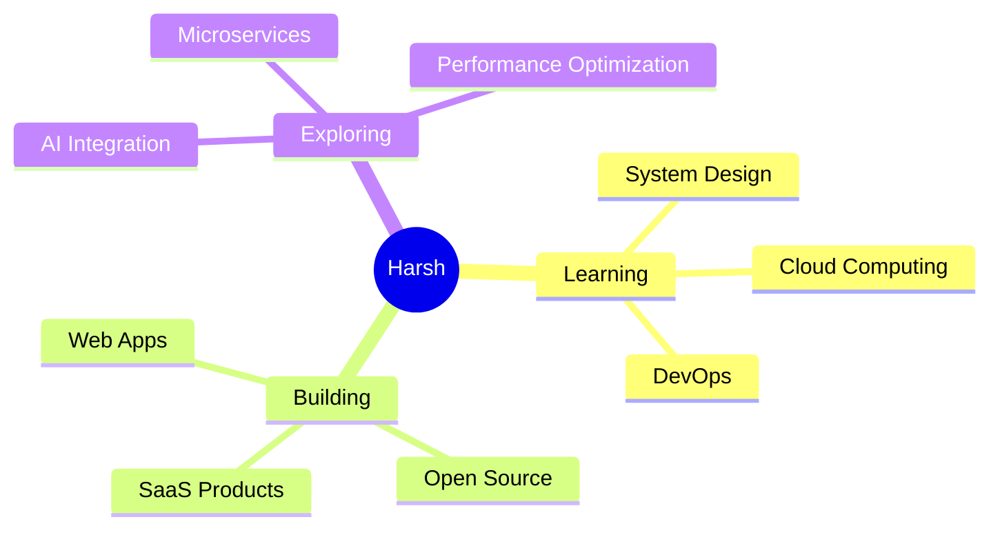

<h1 align="center">
  
</h1>

<h3 align="center">
  
</h3>

  
  
  

  

---

### 🚀 About Me

- 🔭 Building **scalable web applications**
- 🌱 Learning **System Design** & **Cloud Architecture**
- 💡 Passionate about **clean code** & **user experience**
- 🎯 Open to **collaborations** on innovative projects
- ⚡ Fun fact: **I turn coffee into code**

 

---

## 🛠️ Tech Arsenal

  

<b>📚 More Technologies</b>

 

**Frontend Magic**
- ⚛️ React.js - Building interactive UIs
- 🎨 Tailwind CSS - Rapid UI development
- 📱 Responsive Design - Mobile-first approach

**Backend Power**
- 🟢 Node.js & Express - RESTful APIs
- 🍃 MongoDB - NoSQL databases
- 🔐 JWT Authentication

**Developer Tools**
- 🔧 Git & GitHub - Version control
- 💻 VS Code - Code editor
- 📮 Postman - API testing

---

## 📊 GitHub Statistics

  
  

  
  

---

## 🏆 Achievements

  

---

## 📌 Pinned Projects

  
  

---

## 🎯 Current Focus

---

## 💻 Coding Activity

<!--START_SECTION:waka-->
<!--END_SECTION:waka-->

  

---

## 🎨 Latest Work

  

---

<h3 align="center">💬 Let's Connect and Build Something Amazing!</h3>

  
  
  

  

